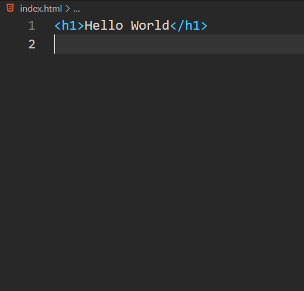
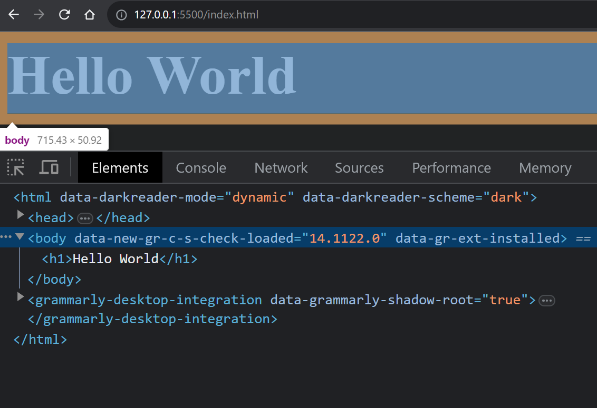

# HTML Overview

Did you know there are 27.7 million web developers worldwide?

63.8% of web developers are self-taught, and a whopping 13.3% find HTML the easiest programming language to learn.

Let's dive into the world of HTML together with us. 🚀

> [Click Here to see the above stats](https://colorlib.com/wp/web-development-statistics/)

HTML, is the standard markup language for describing the structure of documents displayed on the web.

HTML consists of a series of elements and attributes which are used to mark up all the components of a document to structure it in a meaningful way.

> A web page can exist without CSS and JavaScript. But not without HTML!

HTML is the acronym is the `Hypertext Markup Language` Let's decode these words together.

# What do you mean by Hypertext?

The term `Hypertext` is derived from `hyperlinks`, which are the clickable links that enable non-linear navigation.

The `Hypertext` allows users to jump from one piece of information to another, creating a non-linear reading or browsing experience according to user interests and needs.

# What do you mean by Markup?

The `Markup` refers to the set of elements or tags used to structure and format the content of a web page.

In other words, Markup is a way of annotating or labeling different parts of a document to define their meaning or purpose.

```html
<p>This Is The Div Soup Docs.</p>
```

In the above example, the `<p>` tag is an example of markup. It tells the browser that the enclosed text should be treated as a paragraph.

> According to the [colorlib](https://colorlib.com/wp/web-development-statistics/), 13.3% say that HTML is the easiest programming `Language` to learn.

# What do you mean by "L" in HTML?

HTML is the standard markup language used for creating web pages. It defines the structure and layout of a web page by using a variety of tags and elements.

This ensures proper rendering and interpretation of text in different languages and character sets.

# What is an element?

HTML consists of a series of elements, which you use to enclose, or wrap, different parts of the content to make it appear or act in a certain way.

HTML elements are represented by tags, written using angle brackets ( < and > ).

```html
<h1>This Is The Div Soup Docs.</h1>
```

In the above code, `This Is The Div Soup Docs.` is the content of our element. The content goes between the open and closing tags. The entire entity, _the opening tag (`<h1>`)_, _the closing tag (`</h1>`)_, and _the content_ is the `element`.

HTML elements provide the semantics and formatting for documents, including creating paragraphs, lists and tables, and embedding images and form controls. Each element may have multiple attributes defined.

Some elements in HTML can hold content inside them, like words or other things. But there are also elements in HTML that don't hold any content and just have a special name and features.

There are several categories of elements, including metadata, section, text, inline, block, form, interactive, media, etc.

# Difference b/w Elements and Tags?

Elements and tags aren't the exact same thing, though many people use the terms interchangeably. The tag name is the content in the brackets <...>, in this case, `<h1>`.

While an `element` is the opening and closing tags, and all the content between those tags, including nested elements as well.

```html
<h1>This Is <strong> The Div Soup </strong> Docs.</h1>
```

This heading element has other elements nested in it. So the element will be entire heading element i.e. `<h1>This Is <strong> The Div Soup </strong> Docs.</h1>`.


# Correct ways to nest HTML elements?

When nesting elements, it's important that they are properly nested.

```html
<h1>This Is <strong> The Div Soup </strong> Docs.</h1>
```

In the above code snippets, the correct way to nesting an element inside another element. But what about this?⬇️

```html
<p>This Is <strong> The Div Soup Docs.</p></strong>
```

Well, it is not the correct way to nest HTML elements, and it will not work as expected!

```html
<div>
  <section>
    <main>
      <h1>This Is <strong> The Div Soup </strong> Docs.</h1>
    </main>
  </section>
</div>
```

As you can see in the above code, there are two directions to follow:

1. Forwards direction - Such as `<div>, <section>, <main>, <h1>, <strong>`
2. Reverse direction - Like `</strong>, </h1>, </main>, </section>, </div>`, So we can say that, HTML tags should be closed in the `reverse order` of which they were opened.

> Browsers do not display the tags. The tags are used to explain the content of the page.

# Can we omit the opening and closing tags?

HTML is very forgiving. If we omit the closing tags, the closing tags are understood by the browser. Like `<h1>This Is The Div Soup Docs.`, Although it is valid to not close an `<h1>` , but its not a good practice. In the specification both an opening tag and a closing tag are required.

> Browsers will include elements even if the tags aren't present in the markup, Because elements can be understood by the browser.

Do you know? An element can exist even when the tags don't. Look at these below images.



In the above image, I just added one line of code. i.e., `<h1>Hello World</h1>`, and the browser automatically added boilerplate code with the `<body>` element. 🥰



Long story sort, while it is valid to omit tags, but don't. As already [mentioned](#correct-ways-to-nest-html-elements), make sure they are correctly nested. Your future self as a maintainer of markup, and anyone else working on your code base, will thank you. 🥰

# What do you mean by attributes in HTML?

Let's take an example:

```html

```

You may have noticed in the above code that `` had more than just the element type in its opening tag. These extra bits of space-separated name/value pairs are called attributes. Attributes are what make HTML so incredibly powerful.

Attributes give extra information about the element. They are part of the opening tag and don't display in the content you see on the webpage. However, they play a crucial role in determining how the content is displayed, ensuring it's accessible to both people who can see and those who use assistive technologies or search engines.

Attributes only appear in the opening tag. The opening tag always starts with the element type. Like `img, h1, p, strong`, etc.

The attributes can be zero or more than one, separated by one or more spaces. Most attribute names are followed by an equal sign equating it with the attribute value, wrapped with opening and closing quotation marks. Such as `src="computer.png"` and `alt="computer image"`

> HTML is not case-sensitive, but some `attribute` values are. But values that are defined in the specification are case-insensitive.

To make your HTML code easier to read, it's a good practice (although not mandatory) to use lowercase letters for all your element names and attribute names inside your tags. Also, it's helpful to enclose attribute values in quotation marks.

# A Little bit about DOM and JavaScript

The Document Object Model (DOM) is the data representation of the structure and content of the HTML document.

When a browser reads (parses) HTML, it makes a JavaScript object for each element and piece of text it finds. These objects are called nodes — `element nodes` and `text nodes`, respectively.

Every HTML element has a defined set of things it can do, and the HTML DOM API lets you interact with and control each of these elements on a web page.

HTML documents are basically a tree of `nodes`, including HTML elements and text nodes.
