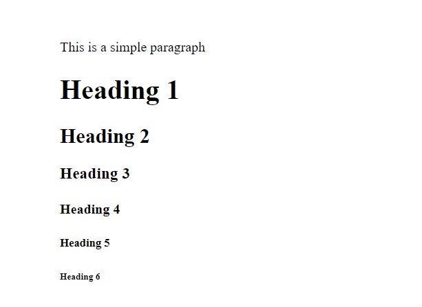
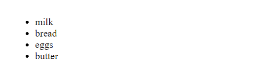
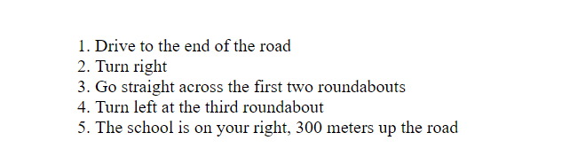
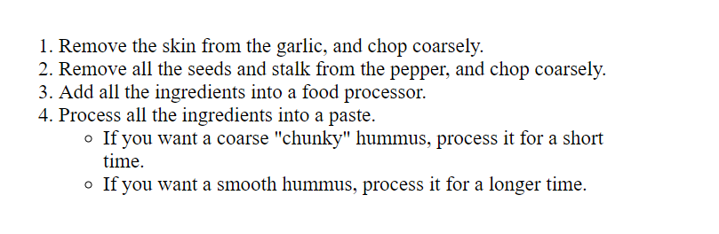
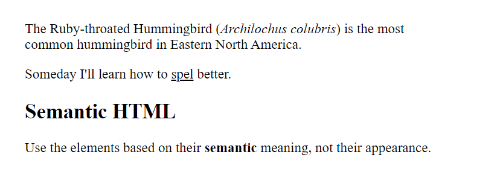

# HTML Text Fundamentals

HTML serves as the backbone of web documents, providing a structured format for organizing and presenting text content. By using HTML elements and tags, developers define the layout and hierarchy of content within a web page. This is done by defining headings, paragraphs, lists, adding emphasis on words and more.

Let's dive deeper into these topics and learn how to write a well-structured document. 🚀

# Why do we need semantics?

Semantics refers to the study of _meaning_ in language. Simply put, it means understanding how words, phrases, and sentences convey specific meanings and how these meanings are interpreted by individuals.

For example, for a traffic light, we know the "red" light means "to stop" and the "green" light means "to go". So semantics is everywhere around us.

In web develoment, Semantics refers to the meaning or intent conveyed by the HTML elements used to structure a webpage.

Suppose, we have a web page where we have used `<h1>` tag to define the main heading for the page.

```html
<h1>The Div Soup Documentation</h1>
```

This `<h1>` element is also a semantic element. It conveys a special role to the browser of a **top level heading**. We can always change its styling with CSS but its semantic meaning is used by search engines and screen readers.

On the other hand, we can also use a `<div>` or a `<span>` tag and use CSS to increase its font size and make it look like a top level heading.

```html
<div>The Div Soup Documentation</div>
```

In this case, these `<div>` and `<span>` tags do not hold any meaning. They are non-semantic tags. Hence they do not convey any special role to the browsers.

It is important to use relevant, semantic HTML element to structure the text of a document.

# Headings and paragraphs

HTML has a `<p>` tag to represent paragraphs and six heading elements - `<h1>`, `<h2>`, `<h3>`, `<h4>`, `<h5>` and `<h6>`. Each of these headings represent a different level of content in an HTML document.

`<h1>` is the main heading of the page. `<h2>` represents subheadings, `<h3>` is for sub-subheadings and so on.

```html
<p>This is a simple paragraph</p>

<h1>Heading 1</h1>
<h2>Heading 2</h2>
<h3>Heading 3</h3>
<h4>Heading 4</h4>
<h5>Heading 5</h5>
<h6>Heading 6</h6>
```



The above image shows the different heading levels and a paragraph element. By default, browsers usually render heading tags with larger font sizes and bold text, with `<h1>` being the largest and `<h6>` the smallest.

# Implementing structural hierarchy

These heading tags and paragraph tags are used to give a proper structure to an HTML document.

For example, in this story, `<h1>` is used for the main story title. `<h2>` defines each chapter title and lastly `<h3>` is used for subsections of a chapter.

```html
<h1>The Crushing Bore</h1>

<p>By Chris Mills</p>

<h2>Chapter 1: The dark night</h2>

<p>
  It was a dark night. Somewhere, an owl hooted. The rain lashed down on the…
</p>

<h2>Chapter 2: The eternal silence</h2>

<p>Our protagonist could not so much as a whisper out of the shadowy figure…</p>

<h3>The specter speaks</h3>

<p>
  Several more hours had passed, when all of a sudden the specter sat bolt
  upright and exclaimed, "Please have mercy on my soul!"
</p>
```

It is important to define a proper structure and hierarchy of content in an HTML document. It makes it easier for users to read and understand the web page.

Some important points to remember while creating these structures:-

- Use a single `<h1>` tag which defines the main heading for a page. All the other sections will follow after this main hierarchy.

- Use the heading tags in correct order. Don't jump straight to `<h3>` tag before using an `<h2>` tag for subheadings.

- Don't use deep hierarchy levels of headings. Aim to go for only 3 levels of headings in a single page.

# Why do we need a structure?

To understand this, let's look at an example.

We have a recipe page. Look how the content is just one big chunk of paragraph. This is because the page doesn't use any elements to differentiate between headings or paragraphs so the browser renders the content as plain text.


It is noticeable from this example that without a proper structure, it becomes difficult to read and understand a page's content.

Defining a proper structure also has few more benefits:-

- **User Attention and Content Hierarchy:** Users spend a very little time browsing through a web site. They often just read the headings to quickly scan over the content. Hence a proper hierarchy of content is important to grab their attention.

- **SEO (Search Engine Optimization):** Search engines rely on HTML structure to understand the content and context of a web page. Using heading tags (\<h1> to \<h6>), paragraph tags (\<p>), lists (\<ul>, \<ol>), and other semantic elements helps search engines accurately index and rank a page's content, improving its visibility in search results.

- **Readability and Maintainability:** A well-structured HTML document is easier for developers to read and understand. Clear organization and semantic markup make it simpler to navigate and maintain code, especially in large projects or when collaborating with other developers.

- **Accessibility:** Proper HTML structure ensures that content is accessible to all users, including those using screen readers or other assistive technologies. Semantically correct markup helps screen readers understand the organization of content, improving the experience for users with disabilities.

# Lists

On an HTML document we can use 3 types of lists :- _ordered lists_, _unordered lists_ and _description lists_.

## Unordered Lists

These lists are defined by `<ul>` tag. Each item in this list is wrapped within an `<li>` tag.

These include items which are not required to be numbered. For example: a shopping list, features of a product on a landing page

```
milk
bread
eggs
butter
```

Even if the order of these items is changed, we still know this list refers to a shopping list. Its content doesn't lose any meaning.

To render the above list in HTML, we write it as:-

```html
<ul>
  <li>milk</li>
  <li>bread</li>
  <li>eggs</li>
  <li>butter</li>
</ul>
```



These lists present a collection of items in a bulleted format. We can change this bullet symbol using CSS `list-style-type` property. Its default value is `disc` which is shown in the above image. Other values are - `circle`, `square` etc.

## Ordered Lists

These lists are defined by `<ol>` tag. Each item in this list is wrapped within an `<li>` tag.

This element is used to define lists where the order of items _does_ matter. For example: as steps in a process, ranking of items etc.

```
Drive to the end of the road
Turn right
Go straight across the first two roundabouts
Turn left at the third roundabout
The school is on your right, 300 meters up the road
```

If we change the order of these direction, it will lose its meaning and not lead the traveller to the correct destination.

To render the above list in HTML, we write it as:-

```html
<ol>
  <li>Drive to the end of the road</li>
  <li>Turn right</li>
  <li>Go straight across the first two roundabouts</li>
  <li>Turn left at the third roundabout</li>
  <li>The school is on your right, 300 meters up the road</li>
</ol>
```



These lists present a collection of items using sequential numbers or letters. Here also we can use CSS `list-style-type` property to change the style of the numbering or lettering used to mark each item.

Some common values for the `list-style-type` property in ordered lists are:

- **decimal:** Renders list with Arabic numerals (1, 2, 3, ...).
- **lower-alpha:** Renders list with lowercase alphabetical letters (a, b, c, ...).
- **upper-alpha:** Renders list with uppercase alphabetical letters (A, B, C, ...).
- **lower-roman:** Renders list with lowercase Roman numerals (i, ii, iii, ...).
- **upper-roman:** Renders each list item with uppercase Roman numerals (I, II, III, ...).

# Nesting Lists

HTML allows developers to nest list inside another one. This helps to organize content in a more structured and visually appealing way.

We can nest both ordered and unordered lists.

Look at this recipe example from before:

```html
<ol>
  <li>Remove the skin from the garlic, and chop coarsely.</li>
  <li>Remove all the seeds and stalk from the pepper, and chop coarsely.</li>
  <li>Add all the ingredients into a food processor.</li>
  <li>Process all the ingredients into a paste.</li>
  <li>If you want a coarse "chunky" hummus, process it for a short time.</li>
  <li>If you want a smooth hummus, process it for a longer time.</li>
</ol>
```

The last 2 points look related to the point just before them. Hence, to make the list more organized, we can nest those last 2 points in a separate list as:

```html
<ol>
  <li>Remove the skin from the garlic, and chop coarsely.</li>
  <li>Remove all the seeds and stalk from the pepper, and chop coarsely.</li>
  <li>Add all the ingredients into a food processor.</li>
  <li>
    Process all the ingredients into a paste.
    <ul>
      <li>
        If you want a coarse "chunky" hummus, process it for a short time.
      </li>
      <li>If you want a smooth hummus, process it for a longer time.</li>
    </ul>
  </li>
</ol>
```



The above image shows how the nested list looks like. Here, we nested an `ul` list inside an `ol` list. Similarly, we can nest any list inside other.

# Emphasis and importance

In human language, we often use techniques like emphasizing certain words through tone to convey nuances or alter the meaning of a sentence. Similarly, HTML provides semantic elements that allow us to add _emphasis_ or **importance** to specific words or phrases within textual content.

Let's look at these elements!

## Emphasis

To add emphasis to a word or some text in HTML, we use the `<em>` tag. This tag styles the text as _italic_ and are also recognised by the screen readers which can be configured to convey its semantic meaning to users who may not be able to see the visual styling.

```html
<p>This is <em>DivSoup</em> docs.</p>
```

The `<em>` tag is often used to denote text that has stress or importance within a sentence, similar to how you might use italics in traditional writing or typesetting to convey emphasis.

It's important to note that the `<em>` tag should be used for semantic emphasis, rather than just for styling purposes. This means that it should be used to indicate a change in meaning or emphasis within the content, rather than solely for visual styling.

If you only want to add a visual italic styling then use CSS `font-style` property on a `<span>` tag used to wrap that particular content.

## Strong Importance

To denote the strong important of a word or some text in HTML, we use the `<strong>` tag. This tag styles the text as **bold**.

These are also recognised by the screen readers which can be configured to convey its semantic meaning to users who may not be able to see the visual styling.

```html
<p>I am counting on you. <strong>Do not</strong> be late!</p>
```

The `<strong>` tag is often used to denote text that is of particular importance or urgency within a sentence. Hence this tag should also only be used when we want to convey some special meaning for a text rather than just giving it a bold appearance.

For just styling purposes, we can use CSS `font-weight` property instead.

# Bold, Italic and Underline tags in HTML

HTML has `<b>`, `<i>` and `<u>` tags which are used to write bold, italics and underlined text respectively. Before HTML5, these tags were merely used for presentation and added no semantic meaning to the text they enclosed.

Elements like these, which only affect presentation and not semantics, are known as presentational elements.

With HTML5, more emphasis on semantics is given for better accessibilty and SEO. Hence, HTML5 redefined `<b>`, `<i>` and `<u>` tags and gave them _semantic_ roles.

- `<b>` tag : convey a meaning traditionally conveyed by bold: keywords, product names etc.

- `<i>` tag : convey a meaning traditionally conveyed by italic: foreign words, taxonomic designation, technical terms, a thought etc.

- `<u>` tag : convey a meaning traditionally conveyed by underline: proper name, misspelling etc

> People on strongly associate underlines to hyperlinks on any web page. Hence it is recommended to only use underlines for links and for this use CSS to add the underline.

In the below example, `<i>` tag is used to write the scientific name of a humming bird. `<b>` tag is used to highlight a keyword and lastly `<u>` tag is used to show a spelling error.

```html
<p>
  The Ruby-throated Hummingbird (<i>Archilochus colubris</i>) is the most common
  hummingbird in Eastern North America.
</p>

<p>Someday I'll learn how to <u class="spelling-error">spel</u> better.</p>

<h2>Semantic HTML</h2>
<p>
  Use the elements based on their <b>semantic</b> meaning, not their appearance.
</p>
```


